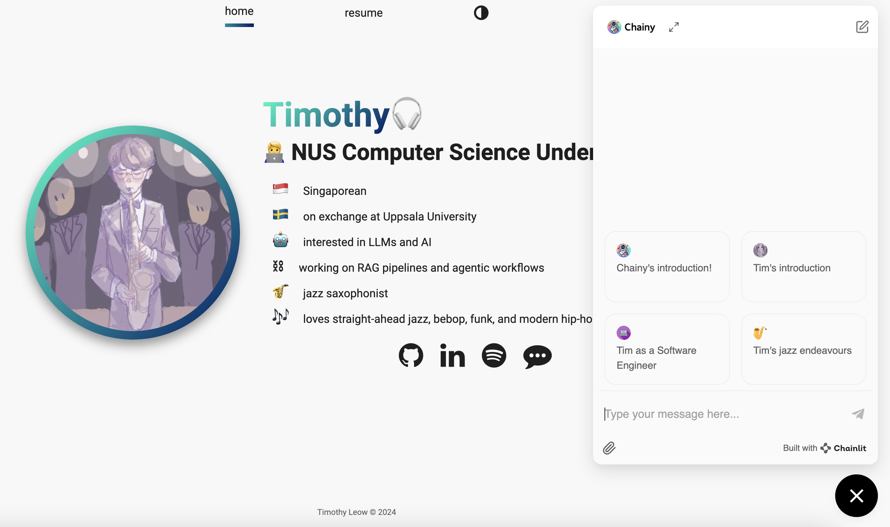
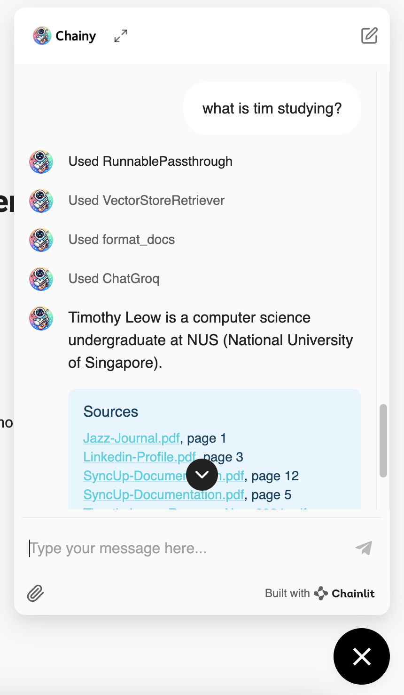
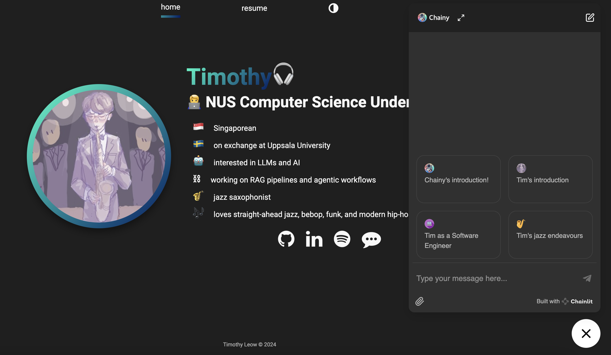

# Personal Portfolio, augmented with RAG Chatbot

Welcome to my personal portfolio! It's actually modified from a   React template by [Payton Pierce](https://www.paytonpierce.dev/) (thank you!). For now, it contains a simple home and resume page, and it has been augmented with a personal project of mine, [Chainy](https://github.com/timleow/chainy), a RAG chatbot that answers questions about me.

It is currently live [here](https://timleow.netlify.app/)!

## Features

- **Interactive RAG Chatbot**: The chatbot can answer questions about my projects and skills, providing a dynamic way to explore my portfolio. This was achieved using chainlit's [co-pilot](https://docs.chainlit.io/deploy/copilot) feature.

- **Dark Mode**: You can toggle it at the top right of the screen. Chainy will follow along too!

